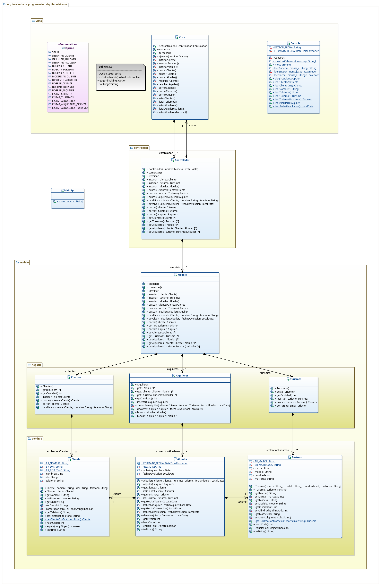

# Tarea: Alquiler de vehículos
## Profesor: José Ramón Jiménez Reyes
## Alumno:José Martínez Estrada

La tarea va a consistir en modelar la gestión de un negocio de alquiler de vehículos. Nuestro nuevo cliente se dedica a alquilar vehículos a sus clientes. En este **primer spring**, el cliente nos pide que sólo contemplemos el alquiler de **turismos**, de los que guarda su **marca**, **modelo**, **cilindrada** y **matrícula**. Para los **clientes** guarda información sobre su **nombre**, **DNI** y **teléfono**.

Cuando un cliente alquila un turismo se crea un nuevo **alquiler** en el que se almacena el **cliente** que lo alquila, el **turismo** que alquila y la **fecha** en que lo alquila. Cuando el cliente devuelve el turismo se almacena la **fecha de devolución**.

El precio que cobra por alquiler de un turismo es el siguiente: **(precioDia + factorCilindrada) * numDias**. El **precioDia** es **20**, el **factorCilindrada** depende de la cilindrada del turismo alquilado y es igual a la **cilindrada del turismo / 10** y **numDias** son los días transcurridos entre la **fecha de alquiler** y la de **devolución**.

Tu tarea consiste en realizar una primera versión de una aplicación para gestionar el negocio de nuestro nuevo cliente.

En este repositorio de GitHub hay un esqueleto de proyecto **gradle** con las dependencias necesarias del proyecto y que ya lleva incluidos todos los test necesarios que el programa debe pasar.

Para ello te muestro un diagrama de clases para el mismo y poco a poco te iré explicando los diferentes pasos a realizar:

#### Primeros Pasos
1. Lo primero que debes hacer es un **fork** del repositorio donde he colocado el esqueleto de este proyecto.
2. Clona tu repositorio remoto recién copiado en GitHub a un repositorio local que será donde irás realizando lo que a continuación se te pide. Modifica el archivo `README.md` para que incluya tu nombre en el apartado "Alumno". Realiza tu **primer commit**.

#### Cliente
1. Crea la clase `Cliente` con los atributos y visibilidad adecuados.
    Crea los métodos de acceso y modificación de cada atributo, teniendo en cuenta que un **nombre** estará compuesto de palabras separadas por un espacio y cada palabra comenzará con una mayúscula y continuará con minúsculas. El **DNI** y el **teléfono** deben también tener un formato válido. Además debes comprobar que la **letra** del **DNI** sea **correcta**. Debes crear las constantes para las expresiones regulares que luego utilizarás en los métodos de modificación. Los métodos de modificación lanzarán las excepciones adecuadas en caso de que el valor que se pretenda asignar al atributo no sea adecuado. También debes tener en cuenta que tanto el nombre como el teléfono de un cliente pueden cambiar.
2. Crea el **constructor con parámetros** que hará uso de los métodos de modificación.
3. Crea el **constructor copia**.
4. Crea el **método de clase** que se indica en el diagrama, que dado un DNI correcto nos devuelva un cliente válido con ese DNI y que será utilizado en las futuras **búsquedas**.
5. Un cliente será igual a otro si su DNI es el mismo. Basándote en ello crea los métodos `equals` y `hashCode`.
6. Crea el método `toString` que devuelva la cadena que esperan los tests.
7. Comprueba que la **clase pasa los test** para la misma y cuando lo haga realiza un **commit**.

#### Turismo
1. Crea la clase `Turismo` con los atributos y visibilidad adecuados.
2. Crea los métodos de acceso y modificación de cada atributo, teniendo en cuenta que la **marca** puede seguir alguno de los siguientes patrones: Seat, Land Rover, KIA, Rolls-Royce, SsangYong. El **modelo** simplemente no debe estar en blanco. La **cilindrada** estará comprendida entre 0 (exclusive) y 5000. La matrícula tendrá el formato de una matrícula española moderna (1111BBB). Debes crear las constantes para las expresiones regulares que luego utilizarás en los métodos de modificación. Los métodos de modificación lanzarán las excepciones adecuadas en caso de que el valor que se pretenda asignar al atributo no sea adecuado.
3. Crea el **constructor con parámetros** que hará uso de los métodos de modificación.
4. Crea el **constructor copia**.
5. Crea el **método de clase** que se indica en el diagrama, que dada una matrícula correcta nos devuelva un turismo válido con dicha matrícula y que será utilizado en las futuras **búsquedas**.
6. Un turismo será igual a otro si su matrícula es la misma. Basándote en ello crea los métodos `equals` y `hashCode`.
7. Crea el método `toString` que devuelva la cadena que esperan los tests.
8. Comprueba que la **clase pasa los test** para la misma y cuando lo haga realiza un **commit**.

#### Alquiler
1. Crea la clase `Alquiler` con los atributos y visibilidad adecuados.
2. Crea los métodos de acceso y modificación de cada atributo, teniendo en cuenta que es posible registrar un alquiler pasado (nuestro cliente a veces apunta los alquileres y luego los pasa a la aplicación). La fecha de alquiler no puede ser posterior a hoy. La fecha de devolución no puede ser igual o anterior a la fecha de alquiler y tampoco puede ser posterior a hoy. Los métodos de modificación lanzarán las excepciones adecuadas en caso de que el valor que se pretenda asignar al atributo no sea adecuado.
3. Crea el **constructor con parámetros** que hará uso de los métodos de modificación.
4. Crea el **constructor copia** que creará una copia y en el caso del cliente y el turismo creará una nueva instancia llamando a sus constructores copia.
5. Crea el método `devolver` que se encargará de asignar la fecha de devoluión si ésta es correcta.
6. Crea el método `getPrecio` que devolverá el precio del alquiler conforme a la fórmula establecida por nuestro cliente y explicada anteriormente.
7. Un alquiler será igual a otro si es el mismo cliente, el mismo turismo y la fecha de alquiler. Basándote en ello crea los métodos `equals` y `hashCode`.
8. Crea el método `toString` que devuelva la cadena que esperan los tests.
9. Comprueba que la **clase pasa los test** para la misma y cuando lo haga realiza un **commit**.

#### Clientes
1. Crea la clase `Clientes` que gestionará una lista de clientes (`Cliente`) sin permitir elementos repetidos.
2. Crea el **constructor por defecto** que simplemente creará la lista.
3. Crea el método `get` que devolverá una nueva lista con los mismos elementos (no debe crear nuevas instancias).
4. Crea el método `getCantidad` que devolverá la cantidad de elementos que contiene la lista.
5. Crea el método `insertar` que añadirá un cliente a la lista si éste no es nulo y no existe aún en la lista.
6. Crea el método `buscar` que devolverá el cliente si éste se encuentra en la lista y `null` en caso contrario.
7. Crea el método `borrar` que borrará el cliente si éste existe en la lista o lanzará una excepción en caso contrario.
8. Crea el método `modificar` que permitirá cambiar el nombre o el teléfono (si estos parámetros no son nulos ni blancos) de un cliente existente y si no lanzará la correspondiente excepción.
9. Comprueba que la **clase pasa los test** para la misma y cuando lo haga realiza un **commit**.

#### Turismos
1. Crea la clase `Turismos` que gestionará una lista de turismos (`Turismo`) sin permitir elementos repetidos.
2. Crea el **constructor por defecto** que simplemente creará la lista.
3. Crea el método `get` que devolverá una nueva lista con los mismos elementos (no debe crear nuevas instancias).
4. Crea el método `getCantidad` que devolverá la cantidad de elementos que contiene la lista.
5. Crea el método `insertar` que añadirá un turismo a la lista si éste no es nulo y no existe aún en la lista.
6. Crea el método `buscar` que devolverá el turismo si éste se encuentra en la lista y `null` en caso contrario.
7. Crea el método `borrar` que borrará el turismo si éste existe en la lista o lanzará una excepción en caso contrario.
8. Comprueba que la **clase pasa los test** para la misma y cuando lo haga realiza un **commit**.

#### Alquileres
1. Crea la clase `Alquileres` que gestionará una lista de alquileres (`Alquiler`) sin permitir elementos repetidos.
2. Crea el **constructor por defecto** que simplemente creará la lista.
3. Crea el método `get` que devolverá una nueva lista con los mismos elementos (no debe crear nuevas instancias).
4. Crea el método `get` para un cliente dado, que devolverá una nueva lista con los alquileres para dicho cliente (no debe crear nuevas instancias).
5. Crea el método `get` para un turismo dado, que devolverá una nueva lista con los alquileres para dicho turismo (no debe crear nuevas instancias).
6. Crea el método `getCantidad` que devolverá la cantidad de elementos que contiene la lista.
7. Crea el método `comprobarAlquiler` que comprobará que en la lista no existe ningún alquiler sin devolver ni para el cliente ni para el turismo y que tampoco hay un alquiler devuelto, del cliente o del turismo, con fecha de devolución posterior a la fecha en la que se pretende alquiler.
8. Crea el método `insertar` que añadirá un alquiler a la lista si éste no es nulo y pasa la comprobación anterior.
9. Crea el método `devolver` que devolverá (asignará la fecha de devolución) si éste existe en la lista o lanzará la excepción en caso contrario.
10. Crea el método `buscar` que devolverá el alquiler si éste se encuentra en la lista y null en caso contrario.
11. Crea el método `borrar` que borrará el alquiler si éste existe en la lista o lanzará una excepción en caso contrario.
12. Comprueba que la **clase pasa los test** para la misma y cuando lo haga realiza un **commit**.

#### Modelo
1. Crea la clase `Modelo` que gestionará todo el modelo de nuestra aplicación. Será la encargada de comunicarse con las tres clases anteriores.
2. Crea el método `comenzar` que creará la instancia de las clases de negocio anteriores.
3. Crea le método `terminar` que simplemente mostrará un mensaje informativo indicando que el modelo ha terminado.
4. Crea los diferentes métodos `insertar`, teniendo en cuenta que ahora ya si insertaremos nuevas instancias utilizando los constructores copia y que en el caso de los alquileres, primero debe buscar el cliente y el turismo y utilizar dichas instancias encontradas.
5. Crea los diferentes métodos `buscar`, que devolverá una nueva instancia del elemento encontrado si éste existe.
6. Crea el método `modificar` que invocará a su homólogo en la clase de negocio.
7. Crea el método `devolver` que  realizará la devolución, si es posible, del alquiler pasado.
8. Crea los diferentes métodos `borrar`, teniendo en cuenta que los borrados se realizarán en cascada, es decir, si borramos un cliente también borraremos todos sus alquileres y lo mismo pasará con los turismos.
9. Crea los diferentes métodos `get`, que deben devolver una nueva lista pero que contenga nuevas instancias no una copia de los elementos.
10. Comprueba que la **clase pasa los test** para la misma y cuando lo haga realiza un **commit**.

#### Opcion
1. Crea el enumerado `Opcion` que contendrá las diferentes opciones de nuestro menú de opciones y que será utilizado posteriormente para mostrar las posibles opciones a realizar. Cada instancia debe estar parametrizada con una cadena con el texto adecuado a mostrarnos.
2. Crea el atributo con el texto a mostrar que será asignado en el constructor con parámetro, que también debes crear.
3. Crea el método `esOrdinalValido` que comprobará si el ordinal pasado se encuentra entre los ordinales válidos o no.
4. Crea el método `get` que devolverá la opción adecuada si el ordinal pasado es correcto y lanzará una excepción en caso contrario.
5. Crea el método `toString` que devuelva una cadena con el ordinal y el texto de la opción que luego utilizaremos para mostrar las diferentes opciones del menú.
6. Realiza un **commit**.

#### Consola
1. Crea la clase de utilidades `Consola` que contendrá métodos que serán utilizados desde la vista para mostrar información por consola o leer información de la misma.
2. Crea el constructor adecuado.
3. Crea el método `mostrarCabecera` que mostrará por pantalla el mensaje pasado por parámetro y luego mostrará un subrayado compuesto de guiones con su misma longitud.
4. Crea el método `mostrarMenu` que mostrará una cabecera informando del cometido de la aplicación y mostrará las diferentes opciones del menú.
5. Crea el método `leerCadena` que mostrará el mensaje pasado por parámetro y devolverá la cadena que lea por consola.
6. Crea el método `leerEntero` que hará lo mismo pero con un entero.
7. Crea el método `leerFecha` que hará lo mismo, pero con una fecha. Deberá repetir la lectura mientras la fecha no se haya podido crear correctamente.
8. Crea el método `elegirOpcion` que leerá un entero (utilizando el método anteriormente creado) asociado a la opción y devolverá la opción correspondiente. Si el entero introducido no se corresponde con ninguna opción deberá volver a leerlo hasta que éste sea válido.
9. Crea los demás métodos de la clase que harán uso de los métodos privados anteriormente creados y que son autodescriptivos. Si tienes alguna duda con alguno, no dudes en preguntarme.
10. Realiza un **commit**.

#### Vista
1. Crea la clase `Vista` que será la encargada de la interacción con el usuario y que se comunicará con el controlador para pedirle realizar las diferentes acciones. Crea el atributo correspondiente, aunque aún no existe su clase y te lo marcará como erróneo.
2. Crea el método `setControlador` que asignará el controlador pasado al atributo si éste no es nulo.
3. Crea el método `comenzar` que mostrará el menú, leerá una opción de consola y la ejecutará. Repetirá este proceso mientras la opción elegida no sea la correspondiente a salir. Utilizará los correspondientes métodos de la clase Consola y llamará al método ejecutar de esta clase que describiré a continuación.
4. Crea el método `terminar` que simplemente mostrará un mensaje de despedida por consola.
5. Crea el método `ejecutar` que dependiendo de la opción pasada por parámetro invocará a un método o a otro.
6. Crea los métodos asociados a cada una de las opciones. Estos métodos deberán mostrar una cabecera informando en que opción nos encontramos, pedirnos los datos adecuados y realizar la operación adecuada llamando al método correspondiente de nuestro controlador. También deben controlar todas las posibles excepciones.
7. Realiza un **commit**.

#### Controlador
1. Crea la clase `Controlador` que será la encargada de hacer de intermediario entre la vista y el modelo.
2. Crea los atributos adecuados.
3. Crea el constructor con parámetros que comprobará que no son nulos y los asignará a los atributos. Además debe llamar al método `setControlador` de la vista con una instancia suya.
4. Crea los métodos `comenzar` y `terminar`, que llamarán a los correspondientes métodos en el modelo y en la vista.
5. Crea los demás métodos que simplemente harán una llamada al correspondiente método del modelo.
6. Realiza un **commit**.

#### MainApp
1. Crea la clase `MainApp` con un único método `main` que será el método de entrada a nuestra aplicación. Este método simplemente creará una vista, un modelo y un controlador, pasándoles las instancias antes creadas. Luego simplemente invocará al método comenzar del controlador.
2. Realiza las pruebas que estimes oportunas y cuando consideres que todo es correcto, realiza el último **commit** y seguidamente realiza el **push** a tu repositorio remoto.

#### Se valorará:

- La indentación debe ser correcta en cada uno de los apartados.
- El nombre de las variables debe ser adecuado.
- Se debe utilizar la clase `Entrada` para realizar la entrada por teclado.
- El programa debe pasar todas las pruebas que van en el esqueleto del proyecto y toda entrada del programa será validada, para evitar que el programa termine abruptamente debido a una excepción. Además, que ni decir tiene, el programa no debe contener ningún error léxico, sintáctico, de dependencias, etc.
- La corrección ortográfica tanto en los comentarios como en los mensajes que se muestren al usuario.

- Se valorará la corrección ortográfica tanto en los comentarios como en los mensajes que se muestren al usuario.

